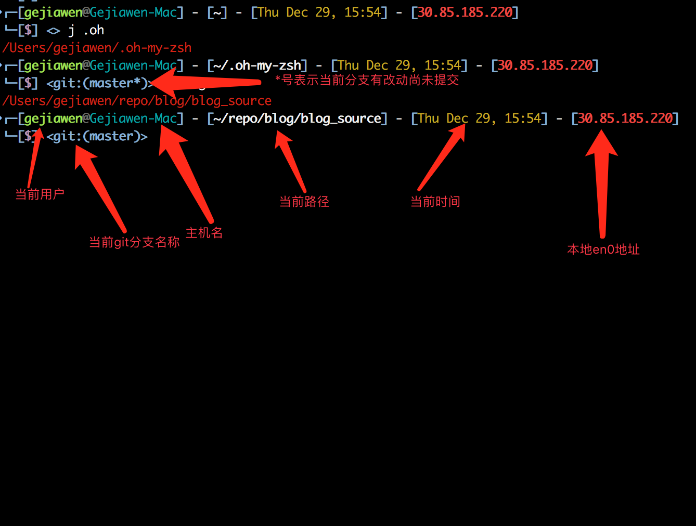

# README

1, copy `xiong-chiamiov-pp.zsh-theme` to your oh-my-zsh's theme folder. Default is `~/.oh-my-zsh/theme`.
2, Change your `ZSH_THEME`. 
3, `vim ~/.zshrc` and set `ZSH_THEME="xiong-chiamiov-pp"`
4, source your `.zshrc` file. `source ~/.zshrc`.
5, enjoy

Here is the snapshot:

